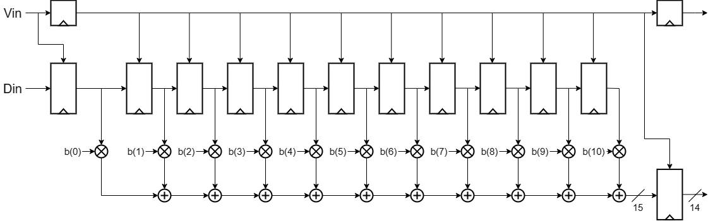
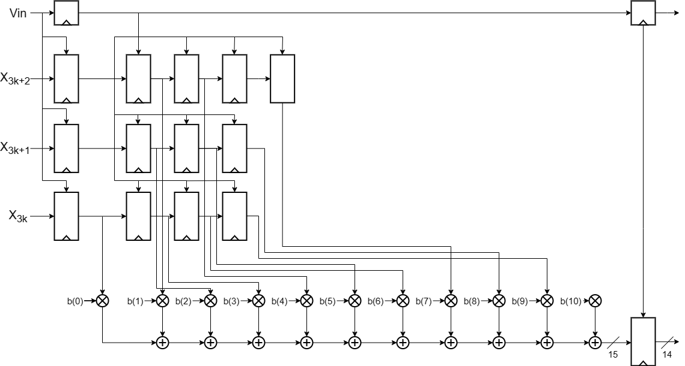

# FIR Filter Implementation (Order 10, 14-bit Precision)

This repository contains the implementation of a Finite Impulse Response (FIR) filter optimized using advanced digital design techniques. The filter features a high-performance architecture tailored for efficient signal processing.

---

## Specifications

- **Filter Order**: 10
- **Bit Precision**: 14 bits

The design is optimized for throughput, area efficiency, and reduced power consumption through advanced techniques such as unfolding and pipelining.

---

## Architecture Overview

### Standard Features

- **Input and Output Interface**:
  - `DIN`: 14-bit input signal.
  - `VIN`: Validation input signal (active high).
  - `DOUT`: Filtered 14-bit output signal.
  - `VOUT`: Validation output signal (active high when `DOUT` is valid).
- **Coefficient Representation**:
  - The coefficients (`B0` to `B9`) are represented as 14-bit fixed-point values, with 1 bit for the integer part and 13 bits for the fractional part.
- **Internal Precision**:
  - Multiplication outputs are 28 bits, truncated to 15 bits to save hardware area and maintain acceptable precision, achieving a Total Harmonic Distortion (THD) of -34 dB.
- **Shift and Accumulation**:
  - An efficient shift-based accumulation process with a shift amount of 19 ensures precision and minimizes truncation errors.

### Entity Definition

The top-level entity, `FIR_adv`, includes the following ports:

```vhdl
entity FIR_adv is
  port (
    CLK     : in std_logic;
    RST_n   : in std_logic;
    DIN3k   : in std_logic_vector(13 downto 0);
    DIN3k1  : in std_logic_vector(13 downto 0);
    DIN3k2  : in std_logic_vector(13 downto 0);
    VIN     : in std_logic;
    B0      : in std_logic_vector(13 downto 0);
    B1      : in std_logic_vector(13 downto 0);
    ...
  );
end FIR_adv;
```

---

## Advanced Optimization Techniques

### Unfolding

Unfolding maximizes parallelism by processing multiple inputs simultaneously. In this implementation, the filter is unfolded by a factor of 3, meaning the architecture handles three input streams and produces three outputs concurrently. This significantly boosts throughput by reducing the processing time per sample.

#### Implementation Steps:
1. **Expression Transformation**:
   - The equations for the three output channels (`y[3k]`, `y[3k+1]`, `y[3k+2]`) were derived by systematically reorganizing the coefficients and delayed inputs to align computations.
2. **Parallel Data Paths**:
   - Dedicated computational paths for each unfolded instance were implemented, sharing common coefficient multipliers where possible.
3. **Area Consideration**:
   - The unfolded design triples the resource usage, increasing the number of adders, multipliers, and registers.

### Pipelining

Pipelining reduces the critical path by splitting long combinational paths into smaller stages with intermediate registers. This technique improves the maximum operating frequency of the filter.

#### Implementations:
- **Single-Stage Pipelining**:
  - Registers were added between the multipliers and the adder chain, reducing the critical path from 3.9 ns to 3.2 ns.
- **Two-Stage Pipelining**:
  - Further divided the adder chain into two smaller stages, but yielded diminishing returns as the critical path was dominated by the multipliers.

### Architecture Comparison

The standard version of the FIR filter is shown below:



An example of the advanced architecture is shown below:




---

## Performance Summary

### Timing
- **Standard Architecture**:
  - Critical Path: 2.90 ns
- **Advanced Architecture**:
  - Unfolding: 3.9 ns
  - Single-Stage Pipelining: 3.2 ns

### Area
- **Standard Architecture**:
  - Total Cell Area: ~10,880 µm²
- **Advanced Architecture**:
  - Unfolded Design: ~27,000 µm²
  - Pipelined Design: ~31,000 µm²

### Power
- **Standard Architecture**:
  - Power Consumption: 322 µW
- **Advanced Architecture**:
  - Power Consumption: 897 µW


---

## Folder Structure

The project is organized into the following directories:

```
.
├── c_code
│   ├── CMakeCache.txt
│   ├── CMakeFiles
│   │   ├── 3.22.1
│   │   ├── cmake.check_cache
│   │   ├── CMakeDirectoryInformation.cmake
│   │   ├── CMakeOutput.log
│   │   ├── CMakeTmp
│   │   ├── fir.dir
│   │   ├── Makefile2
│   │   ├── Makefile.cmake
│   │   ├── progress.marks
│   │   └── TargetDirectories.txt
│   ├── cmake_install.cmake
│   ├── CMakeLists.txt
│   ├── fir
│   ├── Makefile
│   ├── myfilter.c
│   ├── resultsc.txt
│   ├── resultsm.txt
│   └── samples.txt
├── docs
│   ├── drawio
│   │   ├── FIR_adv_1pipe.png
│   │   ├── FIR_adv_2pipe.png
│   │   ├── FIR_adv_final.png
│   │   ├── FIR_adv_unfld.png
│   │   └── FIR_std.png
│   ├── fir_adv_mul.png
│   ├── fir_adv_time.png
│   ├── fir_std_time.png
│   ├── REPORT_final.pdf
│   ├── screenshots
│   │   ├── fir_std_multrunc.png
│   │   ├── fir_std_vin_down.png
│   │   └── fir_std_vin_up.png
│   ├── UNFOLDING_scheme.pdf
│   └── waves
│       ├── adv.png
│       └── std.png
├── FIR
│   └── sim
│       ├── resultsc.txt
│       └── results_hdl.txt
├── FIR_advanced
│   ├── innovus
│   │   ├── design.globals
│   │   ├── FIR_PIPE1
│   │   ...
```

---

## Installation and Usage

### Prerequisites

- VHDL simulation tool (e.g., ModelSim, Xilinx Vivado)
- C compiler (for validating the filter with `myfilter.c`)

### Steps

1. Clone the repository:

   ```bash
   git clone git@github.com:alessandromarchei/FIR_advanced.git
   cd FIR_advanced
   ```

2. Simulate the VHDL code:

   - Use your VHDL tool to compile and simulate the `FIR_adv` entity.

3. Generate the input samples with C code:

   - Navigate to the `c_code` directory.
   - Build and run `myfilter.c`:
     ```bash
     make
     ./fir <inputfile.txt> <outputfile.txt>
     ```

4. Analyze results:

   - Check simulation outputs in the `FIR/sim` directory.
   - Refer to the documentation in the `docs` folder for detailed analysis and performance metrics.

---

## Documentation

- **Diagrams**: Available in the `docs/drawio` folder.
- **Performance Metrics**: See `REPORT_final.pdf` in the `docs` folder.
- **Simulation Waves**: Located in `docs/waves`.

Feel free to explore and contribute!

